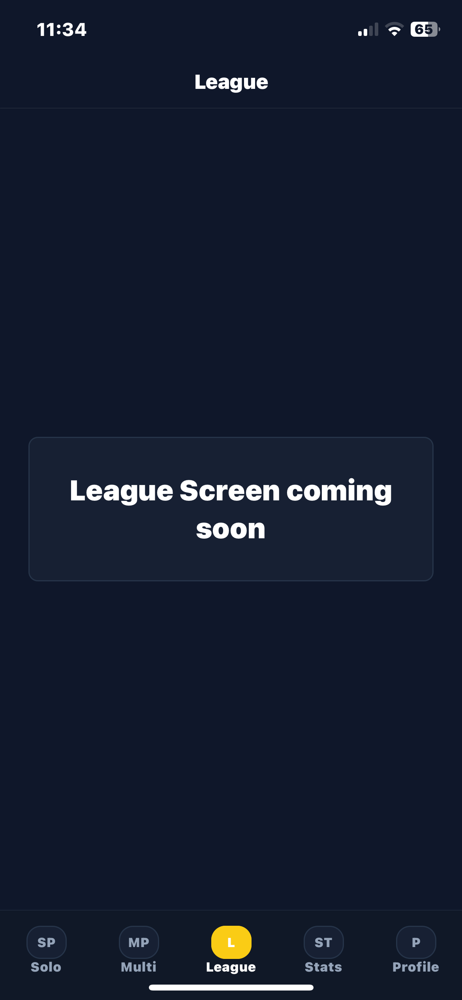
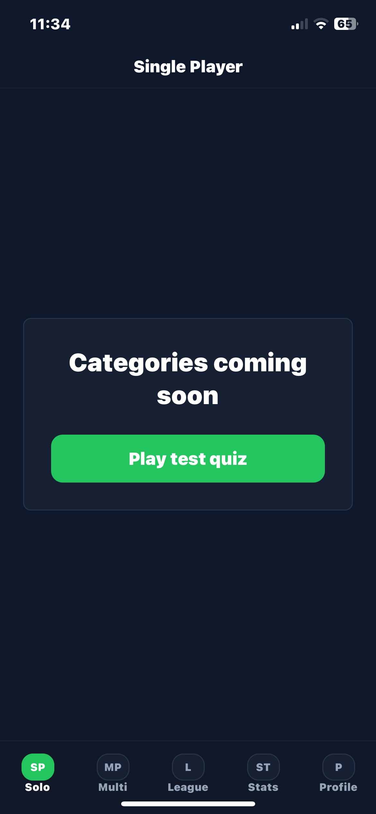
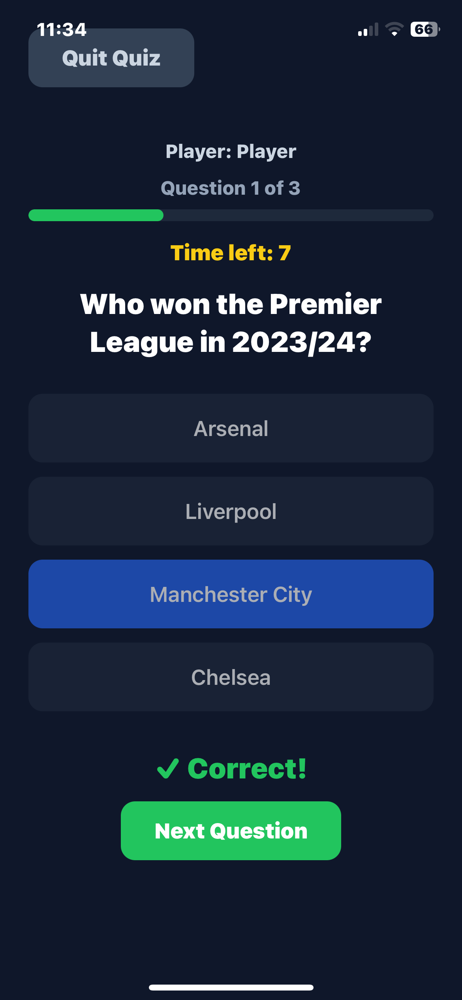
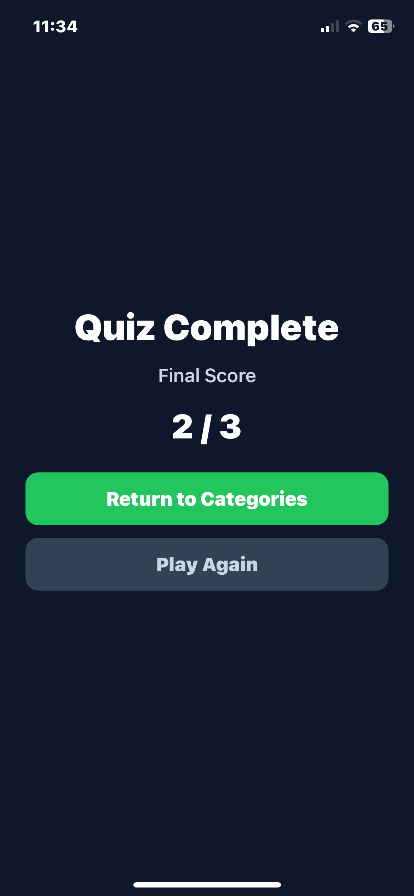

# PubQuizLeague

PubQuizLeague is an in-development mobile application for running recurring pub quiz leagues, managing quiz participation and tracking player performance over time.

The project is being built with React Native, Expo and TypeScript as part of my transition into professional software development. It is also helping me develop a structured and responsible approach to AI-assisted software engineering.

> **Current status:** Active development — early functional prototype and initial domain layer implemented.

---

## Overview

### What is PubQuizLeague?

PubQuizLeague is intended to help pubs, quiz hosts and community organisers run an ongoing quiz league rather than a series of disconnected quiz nights.

The long-term aim is to provide a central place where organisers can:

* run single-player and multiplayer quizzes;
* create and manage quiz leagues;
* record scores and results;
* track player performance across multiple quizzes;
* display statistics, rankings and league standings;
* manage player accounts and participation.

The current version is an early prototype focused on establishing the core quiz flow, application structure and domain model.

---

## Why I Am Building It

I began PubQuizLeague as a practical learning project through which I could develop the skills required to design and build a mobile application from the ground up.

The project allows me to practise:

* TypeScript and React Native development;
* component-based application architecture;
* navigation and state management;
* domain modelling;
* feature planning;
* validation and testing;
* Git and GitHub workflows;
* technical documentation;
* AI-assisted development.

My longer-term goal is to use these skills to build useful public applications and bespoke software for sole traders, local organisations and small businesses.

PubQuizLeague also gives me an opportunity to develop a repeatable AI-assisted workflow in which I remain responsible for the product decisions, architecture, review and testing while using AI tools to improve efficiency and support implementation.

---

## Intended Users

The initial version is primarily a structured learning project and personal product experiment.

The longer-term intended users include:

* pub quiz hosts;
* pubs running recurring quiz nights;
* community groups;
* local leagues;
* individual quiz players.

A future version may be tested in a real local pub environment. The product name, branding and feature priorities may evolve following practical testing and user feedback.

---

## Current Functionality

The application currently includes:

* a working single-player quiz prototype;
* a three-question test quiz;
* player name entry;
* answer selection;
* answer checking;
* score tracking;
* controlled progression between questions;
* a completed-quiz state;
* reusable quiz components;
* application navigation;
* an initial domain model;
* an initial TypeScript domain layer.

The current question set is deliberately small. Its purpose is to validate the quiz flow and provide a foundation that can later support larger question banks.

---

## Development Status

| Area                             | Status                      |
| -------------------------------- | --------------------------- |
| Single-player quiz flow          | Working prototype           |
| Basic score tracking             | Implemented                 |
| Reusable quiz components         | Implemented                 |
| Application navigation           | Implemented                 |
| Domain model                     | Defined                     |
| Core domain layer                | Initial version implemented |
| Expanded question bank           | Planned                     |
| Categories and difficulty levels | Planned                     |
| Detailed results screen          | Planned                     |
| Player statistics                | Planned                     |
| Graphical statistics             | Planned                     |
| Multiplayer quizzes              | Planned                     |
| League management                | Planned                     |
| Authentication                   | Planned                     |
| Persistent data storage          | Planned                     |
| Visual redesign                  | Planned                     |
| Real-world user testing          | Future milestone            |

---

## Planned Features

### Quiz Features

* larger question banks;
* quiz categories;
* difficulty levels;
* timed questions;
* detailed results;
* answer review;
* performance summaries.

### Player Features

* user accounts;
* player profiles;
* quiz history;
* accuracy statistics;
* average response times;
* strongest and weakest categories;
* progress over time.

### Multiplayer Features

* simultaneous multiplayer quizzes;
* hosted quiz sessions;
* joining through a code or link;
* live scores;
* multiplayer results.

### League Features

* league creation;
* league membership;
* recurring quiz events;
* cumulative standings;
* league results;
* player rankings;
* organiser controls.

---

## Technology Stack

* **React Native** — mobile application development
* **Expo** — development environment and application tooling
* **TypeScript** — type-safe application and domain code
* **Expo Router** — file-based application navigation
* **Git** — version control
* **GitHub** — repository hosting and project documentation

The technology stack may expand as persistent storage, authentication, testing and backend services are introduced.

---

## Project Structure

The application is being organised around clear responsibilities rather than placing all functionality in a single file.

Current areas include:

```text
app/
  Application screens and navigation

components/
  Reusable interface components

data/
  Quiz question data

domain/
  Core domain entities, rules and identifiers
```

As the project grows, further layers may be introduced for application use cases, persistence, services and infrastructure.

---

## Domain Model

The domain model defines the main concepts that the application will need to represent.

Current domain concepts include:

* users;
* profiles;
* institutions;
* leagues;
* league memberships;
* quiz rules;
* league results;
* domain identifiers.

The domain layer is being developed separately from the user interface so that the central business concepts and rules are not dependent on React Native components.

This should make the application easier to understand, test and extend as multiplayer and league functionality are introduced.

---

## Running the Project Locally

### Requirements

Before running the project, ensure that the following are installed:

* Node.js;
* npm;
* Git;
* Expo Go or an appropriate mobile simulator.

### Installation

Clone the repository:

```bash
git clone https://github.com/ejag23/PubQuizLeague.git
```

Navigate into the project:

```bash
cd PubQuizLeague
```

Install the dependencies:

```bash
npm install
```

Start the Expo development server:

```bash
npx expo start
```

Follow the terminal instructions to open the application using Expo Go, an iOS simulator, an Android emulator or a web browser.

---

## Validation

The project currently uses TypeScript and linting to identify errors and maintain code quality.

Recent domain-layer changes were validated using:

```bash
npx tsc --noEmit
```

and:

```bash
npm run lint
```

Both checks passed successfully following the initial implementation of the domain layer.

Automated unit and integration tests have not yet been introduced. Testing will become increasingly important as domain rules and application use cases are added.

---

## Roadmap

### Phase 1 — Single-Player Foundation

* [x] Create a working quiz flow
* [x] Add answer selection and checking
* [x] Add score tracking
* [x] Add quiz completion state
* [x] Separate question data from screen code
* [x] Introduce reusable components
* [x] Establish application navigation
* [ ] Expand the question bank
* [ ] Add categories
* [ ] Add difficulty levels
* [ ] Add detailed results
* [ ] Add player statistics

### Phase 2 — Domain and Application Architecture

* [x] Create the initial domain model
* [x] Implement the minimum viable domain layer
* [ ] Define application use cases
* [ ] Introduce domain validation
* [ ] Add unit tests
* [ ] Connect the domain layer to application features

### Phase 3 — Player Accounts and Persistence

* [ ] Add authentication
* [ ] Add player profiles
* [ ] Store quiz history
* [ ] Persist player statistics
* [ ] Add account management

### Phase 4 — Multiplayer Quizzes

* [ ] Create hosted quiz sessions
* [ ] Allow players to join a session
* [ ] Support simultaneous play
* [ ] Add multiplayer scoring
* [ ] Add multiplayer results

### Phase 5 — Quiz Leagues

* [ ] Create and manage leagues
* [ ] Add league membership
* [ ] Record recurring quiz results
* [ ] Calculate standings
* [ ] Display league rankings
* [ ] Produce final league results

### Phase 6 — Product Refinement

* [ ] Redesign the mobile interface
* [ ] Improve accessibility
* [ ] Conduct real-world user testing
* [ ] Gather feedback from quiz hosts and players
* [ ] Refine the product scope
* [ ] Prepare a stable release

The roadmap is expected to evolve as the project develops and new technical or product requirements become clearer.

---

## Development Approach

The project uses an AI-assisted development workflow.

AI tools are used to support tasks such as:

* exploring implementation approaches;
* generating initial code proposals;
* explaining unfamiliar code;
* identifying potential issues;
* suggesting tests;
* reviewing architecture;
* improving documentation.

However, generated work is reviewed before being accepted. I remain responsible for:

* defining the product;
* deciding the architecture;
* understanding the code;
* reviewing changes;
* testing the application;
* validating the results;
* maintaining the repository.

The objective is not simply to generate an application quickly. It is to develop a reliable working method that combines human judgment with the speed and support of modern development tools.

---

## What I Have Learned

The project has already helped me develop a stronger understanding of:

* React Native and Expo;
* TypeScript;
* component architecture;
* application state;
* file-based navigation;
* reusable components;
* domain models;
* separation of concerns;
* Git branches, commits and repository synchronisation;
* debugging and validation;
* technical documentation;
* structured AI-assisted development.

One of the most important lessons has been the value of building software incrementally. The project began as a small single-screen quiz and is gradually being restructured into a more maintainable application with clearer product and domain boundaries.

---

## Current Limitations

PubQuizLeague is not currently a production-ready application.

The present version:

* contains only a small test question set;
* does not yet include persistent storage;
* does not include authentication;
* does not yet support multiplayer play;
* does not yet support active quiz leagues;
* has limited automated testing;
* uses an interface that will require further visual refinement.

These limitations are expected at the current stage and are recorded here to make the project’s status clear.

---

## Screenshots

### Home Screen

.PNG)

### Temporary Holding Screen



### Single-Player Quiz



.PNG)



### Quiz Results



---

## Repository Purpose

This repository serves as:

* the working codebase for PubQuizLeague;
* a record of my development progress;
* evidence of my software-development learning;
* a place to document architectural decisions;
* a practical example of my AI-assisted development workflow.

---

## Author

Developed by **Ed Graves** as an ongoing software-development and product-design project.
